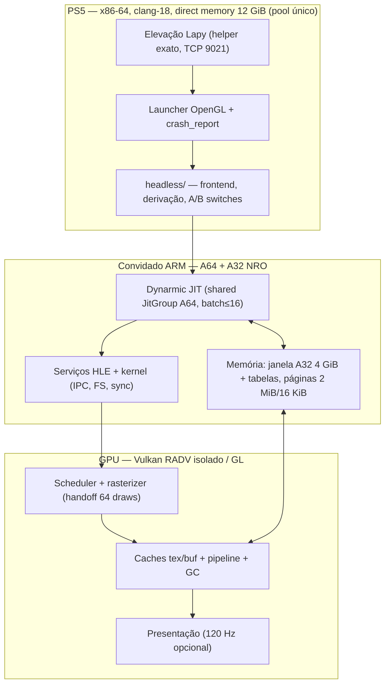

# SDD Performance — 01 Architecture Audit

Auditoria estática do repositório (Etapa Zero). Toda afirmação estrutural
cita o código; conclusões marcadas CONFIRMED / HYPOTHESIS / NOT MEASURED /
REJECTED. Nenhum número de desempenho foi medido nesta sessão.

## 1. Visão geral e pins

- Eden `5f142c79` (`UPSTREAM.json:2`, `tools/deps.json:8`), sem modificação
  nos arquivos do Eden: o frontend PS5 em `headless/` substitui e deriva
  fontes em tempo de configure (`headless/inject.cmake`, `docs/BUILDING.md:65-68`)
  [CONFIRMED].
- Dynarmic = `src/dynarmic` do Eden pinado; revisão própria distinta do
  commit do Eden NÃO resolvida no repo (resolver via `make deps-status` +
  gitmodules do Eden) [NOT MEASURED]. Xbyak `7.40.1` pinado
  (`UPSTREAM.json:5`); linkage exato via configure do Eden [HYPOTHESIS].
- Mesa/RADV = checkouts Mihawk pinados (`tools/deps.json:121-143`:
  PS5_Vulkan `3f3ee69`, PS5_Mesa `0b2d6d1`, SDK fork `95c08f2`); string de
  versão do Mesa não consta no repo [NOT MEASURED].
- Toolchain PS5: clang-18/lld-18, `-fno-plt -femulated-tls`
  (`tools/ps5.cmake:15`, `headless/CMakeLists.txt:61-70`), emutls.c do
  LLVM 18.1.8 com `EMUTLS_SKIP_DESTRUCTOR_ROUNDS=1`. Dynarmic compila com
  `-flto=thin`; o resto segue o "qualified non-LTO build path"
  (`headless/CMakeLists.txt:44-47`) [CONFIRMED].
- Build documentado: Ubuntu 26.04 (`Makefile:4`); CI =
  `.github/workflows/release.yml` (runner 24.04 + container 26.04) com
  build+empacotamento, sem jobs de teste/lint/format [CONFIRMED].
- Dependências vizinhas: boilerplate Payload SDK v0.42 `dd44bbd`, helper
  Lapy `c3bdfe3` (runs assistidos pendentes, `docs/BUILDING.md:30`),
  pacbrew 0.40.2, OpenGL SDK 1.0.0, FFmpeg `c7b5f15`, fmt 12.1.0
  [CONFIRMED].

## 2. Fluxo de execução de um jogo

Elevação → launcher → janela → Load → `GPU.Start` → `OnGpuReady` →
pré-carga de shaders (`EDEN_SHADER_CACHE_LOADED`, `main.cpp:1244`) → Run.
Marcos de visibilidade: `EDEN_LOADING_DONE` / `EDEN_GAME_VISIBLE`
(`graphics.cpp:248-253`) [CONFIRMED].

Defaults de sessão: `renderer_debug=false`, VRAM Aggressive (6 GiB; o modo
4 GiB causava GC por frame a 20-25 FPS, `main.cpp:654-658`), GPU High, DMA
Default, `Memory_4Gb` (`main.cpp:653-668`) [CONFIRMED].

## 3. Fluxo CPU → GPU

Guest (núcleos 0-2, afinados) → scheduler/OnCPUWrite/GetFlushArea (com
`Timer` guest_cpu_write/read, `prepare-vulkan-port.py:79-82`) → fila GPU →
worker Vulkan (pino próprio, stack 1 MiB, `native_gpu_thread.inc:27-52`) →
dispatch em lotes (handoff a cada 64 draws, chunk 32 KiB, flush 4096 draws,
`prepare-vulkan-port.py:93-98`) → caches tex/buf/pipeline → present
[CONFIRMED].

Sincronização medida por contadores cumulativos (`EDEN_DEV_GPU`:
idle/dispatch/drain/present/full/draws, `performance.cpp:424-431`); o
analisador tira deltas entre relatórios — somar chamadas sobrepostas é
proibido (`performance.h:210`) [CONFIRMED].

## 4. Subsistemas críticos

### 4.1 JIT (Dynarmic + compartilhamento)
- Um namespace de código por processo convidado para A64
  (`shared-jit.cmake:1`): blocos publicados no `JitGroup`, valores por
  núcleo via `ABI_JIT_PTR` (`shared-jit.cmake:44-57`); `jit_shared=off`
  volta a blocos por núcleo (`main.cpp:713-715`) [CONFIRMED].
- Orçamentos: A64 256/192/192/16 MiB, A32 512/64/64/16 MiB, Null 8 MiB,
  impostos por `tools/check-performance.py:30-32` [CONFIRMED].
- Batch de compilação ≤16 blocos, 32 pendentes, sem seguir indiretos/SVC
  (`jit-compile-batch.inc:10-13`) [CONFIRMED].
- Pré-compilação por lista de blocos (`jit_list.h`): 518 mil blocos, 4 MB,
  7,8 s em CPU reserva; 426 vs 138.262 compilações em jogo; janela de
  5 s a 30,0 vs 22,3 FPS — medido no console UMA vez, um jogo, A64 apenas,
  desligado por padrão (`jit_list.h:24-33`) [CONFIRMED como relato de
  código; generalização NOT MEASURED].
- Diagnóstico dev: fases A64 (translate/optimize/emit/range),
  `jit_duplicates` (lock+map globais por bloco — custo de instrumentação,
  dev-only), PC sampling ~500 Hz (`performance.h:24-36`) [CONFIRMED].

### 4.2 Fastmem e memória convidada
- Janela A32 de 4 GiB + mapa de 1 B/página abaixo + grânulo de guarda
  (`host_memory.cpp:68-77`); teste inline + fallback out-of-line
  (checked-fastmem), exclusivos sempre na tabela
  (`checked-fastmem.cmake:1-8,242-257`); handler lock-free com 64 ranges
  (`fastmem_handler.cpp:28-30`) [CONFIRMED].
- **A32 fastmem DESLIGADO por padrão no console**: "slower than the
  page-table path", opt-in `fastmem=on` (`main.cpp:644-646`); arena só
  para apps 32-bit (`CMakeLists.txt:850-858`) [CONFIRMED]. Causa raiz da
  lentidão [NOT MEASURED] — reativar sem medição: REJECTED.
- Páginas: grânulo 16 KiB (página do kernel PS5); blocos ≥2 MiB alinhados
  para huge pages (alcance de TLB, `memory_pages.cpp:42-47`); mapeamentos
  CPU com hint `0x1000000000`, ≥ `0x300000000`, abaixo de `0x4000000000`
  (janela RADV, `memory_pages.cpp:17-27`) [CONFIRMED].

### 4.3 Vulkan / RADV / apresentação
- Derivação por âncoras com falha fatal se o Eden pinado mudar
  (`prepare-vulkan-port.py:8-17`, `vulkan.cmake:4-15`); RADV isolado
  `libvulkan_radeon.ps5.a`, fallback PS5VK (`vulkan.cmake:77-95`) [CONFIRMED].
- Barreiras de compute default ON (corrigiu LOD/culling; `dev_vulkan.h:25-29`
  + patches `prepare-vulkan-port.py:21-70`) [CONFIRMED]. Desligar para
  "ganhar FPS": REJECTED sem prova de correção.
- HCR default exato (`hcr_mode=1`), conditional rendering ON, border
  customizado OFF (falha de GPU em página 0 com causa aberta,
  `dev_vulkan.h:12-17`) [CONFIRMED].
- Caches: `GuestCacheLock` (try_lock + ~25 µs de spin, `performance.h:63-80`;
  relato: 1,5-3,2 ms/frame a 8-12 µs/write num mundo aberto);
  `gc_keep_dirty` default ON com guarda de pool (`performance.h:92-127`;
  relato: 10 s a 3-9 FPS e 4,6 s de GC em 5 s antes da correção);
  "uso" medido pelo bloco livre do pool, não pelo driver
  (`performance.h:110-121`) [CONFIRMED como código+relatos; números NOT
  MEASURED nesta sessão]. Reverter `gc_keep_dirty`: REJECTED.
- Cache de shaders OpenGL nativo aparado entre sessões, LRU 64 MiB
  (`cache_budget.h:11-41`, `main.cpp:412-414`); comportamento de
  retenção/evicção/recompilação [NOT MEASURED] — não mexer antes de medir.
- Frame: janelas de 5 s com fps médio + worst (`EDEN_DEV/GAME/VULKAN_FRAME`,
  `graphics.cpp:269-303,645-668`); intervalos em 5 baldes
  (`EDEN_VULKAN_INTERVALS`, `graphics.cpp:639-656`) [CONFIRMED].
  Percentis P50/P95/P99 e amostras por frame: INEXISTENTES [CONFIRMED gap].

### 4.4 Threads e escalonamento
- Topologia via CPUID 0xb, `worker_cpus[5]`, núcleos convidados 0-2 +
  irmãos SMT excluídos de tarefas secundárias (`performance.cpp:127-183`);
  placement secundário ON no Vulkan (relato +17 %, `main.cpp:641-643`);
  relatórios `EDEN_WORKER_*` [CONFIRMED].
- Idle convidado: spin 5000 iterações (~100 µs, `performance.h:147-152`;
  relato 55→59,6 FPS) com `idle_spin_us=`; `cache_spin=` controla o spin
  dos locks [CONFIRMED].
- HLE: `RecordHle` sob `hle_mutex` global + mapa (`performance.cpp:360-370`),
  relatado se ≥1 ms (`EDEN_DEV_HLE`); verificar gate dev-only antes de
  qualquer experimento IPC [HYPOTHESIS — confirmar gating].

### 4.5 Diagnóstico e crash reporting
- `headless/crash_report.h`, `tools/symbolize-crash.py`, watchdog
  (`stall_watchdog.h`), `EDEN_DEV_SETTINGS` ecoando switches ativos
  (`main.cpp:816-830`) [CONFIRMED]. `Snapshot()` só no ramo dev
  (`check-startup-performance.py:19-24`) [CONFIRMED].

## 5. Configurações de build relevantes

| Item | Valor | Fonte |
|------|-------|-------|
| SO de build | Ubuntu 26.04 (+container no CI) | Makefile:4, BUILDING.md:159 |
| Compiladores PS5 | clang-18, lld-18, prospero-* (link LLD 21..15) | BUILDING.md:119-128 |
| Flags PS5 | -fno-plt -femulated-tls, emutls.c 18.1.8 | tools/ps5.cmake:15 |
| LTO | só Dynarmic (thin); resto non-LTO qualificado | CMakeLists.txt:44-45 |
| RADV tools | LLVM 21 host (mesa_clc, vtn_bindgen2) | BUILDING.md:125 |
| Alvos | release/package/image/dev/prepare/deps/test/install | Makefile:35-66 |

## 6. Gargalos potenciais (ordenados por evidência de código)

1. Compilação JIT em áreas novas (stutter de primeira compilação) —
   mitigado por jit_list (um jogo medido) [HYPOTHESIS p/ demais jogos].
2. Contenção nos locks dos caches tex/buf (guest × GPU thread) [HYPOTHESIS].
3. GC de texturas perto do teto do pool [HYPOTHESIS; mecanismo CONFIRMED].
4. Criação de pipelines / tradução de shaders (stutter frio) [NOT MEASURED].
5. Latência de wake-up em handoffs entre núcleos [HYPOTHESIS].
6. Submissão/presentação (tamanho de lote, backpressure) [NOT MEASURED].

## 7. Riscos arquiteturais

- Pool único CPU+GPU: qualquer orçamento isolado mente (R-05).
- Derivação por âncora: robusta a drift (falha fatal), mas cada experimento
  no Eden derivado precisa revalidar âncoras (R-06).
- Lacunas de medição (sem percentis, sem tempo de GPU por frame, sem
  quantização de vkSubmit/fence/barreira/pipeline-cache) cegam
  experimentos Vulkan (R-09).
- CI sem testes: regressões de host entram silenciosas (R-07).

## 8. Decisões REJECTED (não revisitar sem dados novos)

- Reativar A32 fastmem por padrão (`main.cpp:644-646`).
- Reverter `gc_keep_dirty` / voltar ao "expected mark" do Eden.
- Desligar `compute_barriers` / voltar à sincronização original.
- LTO global (caminho qualificado é non-LTO + dynarmic thin).
- Tratar VRAM e sysmem como pools independentes.
- Revisar limites (64 MiB shader cache, 64 draws, 384 MiB short) sem medir
  retenção/evicção primeiro.
