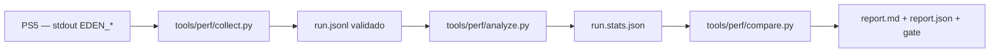

# SDD Performance — 04 Design

Decisões de projeto do programa de desempenho. Cada decisão vincula
código concreto (`arquivo:linha`) e evidências de 01/02; o detalhe
deliberativo vive nos ADRs em `docs/adr/`.

## 1. Índice de ADRs

| ADR | Decisão | Estado |
|-----|---------|--------|
| [ADR-001](../../adr/ADR-001-performance-instrumentation.md) | Instrumentação de baixo overhead, desligável, com percentis por frame | aceito (implementação pendente) |
| [ADR-002](../../adr/ADR-002-jit-optimization.md) | Otimização do JIT por variável única, sem tocar em W^X/invalidação | aceito (experimentos pendentes) |
| [ADR-003](../../adr/ADR-003-vulkan-synchronization.md) | Sincronização Vulkan conservadora; barreiras só mudam com prova | aceito |
| [ADR-004](../../adr/ADR-004-memory-policy.md) | Pool único CPU+GPU; orçamentos pelo bloco livre, nunca pelo driver | aceito |

## 2. Arquitetura de medição

- Fronteira de confiança: `collect.py` valida e marca `complete`;
  `analyze.py` nunca interpola (`incomplete_excluded` no relatório).
- Cumulativos entram só como deltas; séries sobrepostas nunca somam
  (regra normativa de `headless/performance.h:210`).
- Gate: regressão em métrica crítica (`fps_mean`, `worst_mean`,
  `worst_max`, `largest_free`) → saída 1 (`compare_metrics.py`).

## 3. Matriz perfil × parâmetro (PERF-FR-005)

Nenhum parâmetro entra sem experimento ACCEPTED em 09. Estado inicial:
todos os perfis herdam os defaults seguros do código.

| Parâmetro | Código | Accurate | Balanced | Performance | Developer |
|-----------|--------|----------|----------|-------------|-----------|
| `renderer_debug=false` | `main.cpp:653` | fixo | fixo | fixo | fixo |
| VRAM Aggressive (6 GiB) | `main.cpp:658` | fixo | fixo | fixo | fixo |
| GPU High / DMA Default | `main.cpp:665-667` | fixo | fixo | fixo | fixo |
| `gc_keep_dirty=on` | `performance.h:101` | fixo | fixo | fixo | A/B |
| `compute_barriers=on` | `dev_vulkan.h:29` | fixo | fixo | fixo | A/B |
| `hcr_mode=1` | `dev_vulkan.h:36` | fixo | fixo | fixo | A/B |
| `dispatch_draws=64` | `performance.h:156` | 64 | 64→? (H-04) | 64→? (H-04) | A/B 8–512 |
| `idle_spin_us=100` | `performance.h:152` | 100 | 100→? (H-05) | 100→? (H-05) | A/B |
| `cache_spin=256` | `performance.h:68` | 256 | 256→? (H-06) | 256→? (H-06) | A/B |
| block list (`jit_list`) | `jit_list.h:29-33` | off | off→? (H-02) | off→? (H-02) | A/B |
| A32 fastmem | `main.cpp:644-646` | off | off | off | A/B (H-03) |
| `placement=on` (Vulkan) | `main.cpp:643` | on | on | on | A/B |
| contadores dev | `EDEN_DEV_*` | off | off | off | on |

`?` = valor só após ACCEPTED. Performance nunca recebe `dma_accuracy=unsafe`,
`cpu_accuracy=unsafe` ou `gpu_accuracy=low` sem experimento próprio que
meça correção além de FPS (NFR-001).

## 4. Superfície de mudança por experimento

Cada experimento toca exatamente uma destas superfícies (FR-004):

1. Switch `dev-settings.txt` existente (custo ~zero, rollback imediato).
2. Novo switch dev + leitura no caminho frio (`main.cpp`, `memory_pages.cpp`).
3. Instrumentação nova sob `EDEN_DEV_PROFILE` (gate: `check-performance.py` verde).
4. Derivação em `prepare-vulkan-port.py` / `shared-jit.cmake` (gate: âncoras +
   `make test` + A/B no console).

Superfícies 3–4 exigem teste host novo em `tools/check-*.py` ou `tools/perf/`.
